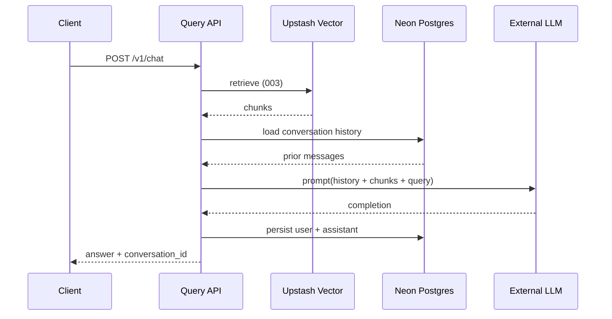

# Implementation Plan: Chat Persistence & External LLM (Feature 006)

**Branch**: `006-chat-persistence-llm` | **Date**: 2026-07-24 | **Spec**: [spec.md](./spec.md)

Extend Feature **003** with Neon conversation memory, external LLM decoder spike,
and Cloud Run deploy (005) with Neon connection secrets. Public contract **4.0.0**.

## Summary

| Layer | Choice |
|-------|--------|
| HTTP | Extend `POST /v1/chat`; add `GET /v1/conversations/:id/messages` |
| Persistence | **Neon Postgres** via `@neondatabase/serverless` |
| Env | `POSTGRES_URL` (pooled); `DATABASE_URL` alias accepted |
| Cloud host | Feature **005** single-container Cloud Run + Secret Manager |
| Local dev | Neon dev branch (preferred) or Docker Postgres offline |
| LLM | `lib/chat/llm/` adapter + Gemini spike |
| Sibling parity | Same Neon/Vercel Postgres pattern as `agentic-foundation` |

## Cloud topology

```text
                    ┌─────────────────────┐
                    │ Neon Postgres       │
                    │ (free tier, TLS)    │
                    │ dedicated DB        │
                    └──────────▲──────────┘
                               │ POSTGRES_URL (Secret Manager)
┌──────────────┐     ┌─────────┴─────────┐     ┌──────────────┐
│   Client     │────►│ Cloud Run         │────►│ Upstash      │
│              │     │ query-api :8080   │     │ Vector       │
└──────────────┘     └───────────────────┘     └──────────────┘
                               │
                               ▼
                         External LLM (Gemini, …)
```

## Constitution Check

- [x] INV-RETRIEVE-001 preserved
- [x] INV-CHAT-001–007 documented
- [x] Dedicated Neon DB (not shared with sibling auth tables)
- [x] No postgres sidecar on Cloud Run

## Request flow



## Project structure (planned)

```text
db/migrations/
lib/chat/                           # conversational-rag, repo (neon), llm/
infra/gcp/                          # enable_chat_persistence secrets
scripts/cloud-run/provision.ps1
scripts/e2e/cloud/
specs/006-chat-persistence-llm/contracts/cloud-run-chat-stack.md
```

## Phase 2: Tasks

See [tasks.md](./tasks.md).
